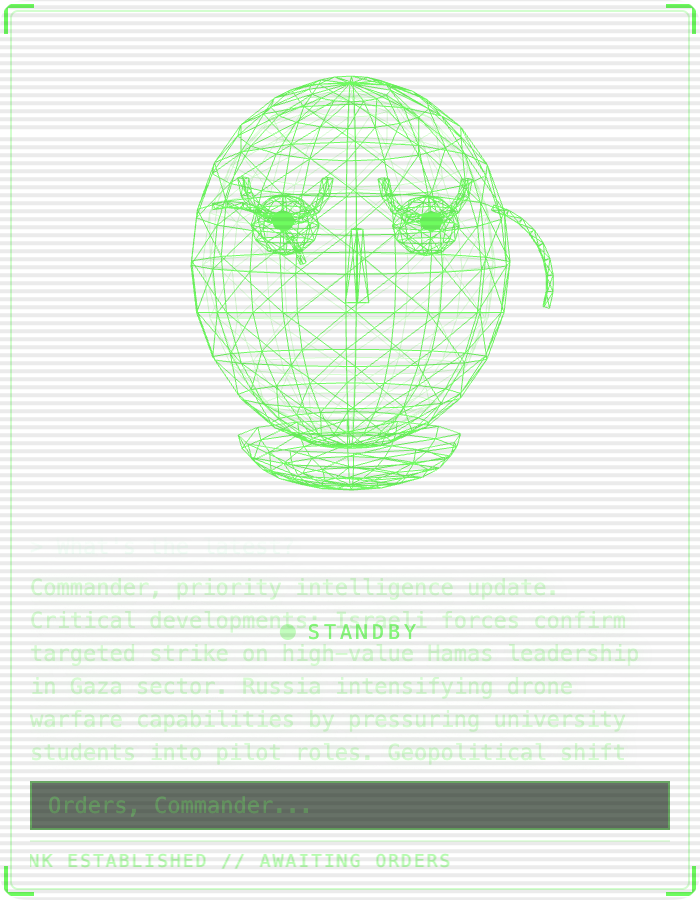

# Adjutant

An AI desktop overlay assistant. A green wireframe face sits in the corner of your screen, connected to Claude, ready to answer questions, execute tasks, read your screen, and brief you on RSS feeds — all in a tactical comm-filtered voice.



## Features

- **Wireframe 3D face** — Procedural Three.js head with idle, listening, speaking, processing, and alert animations. Bloom glow, scanline overlay, and CRT effects.
- **Voice I/O** — Push-to-talk (Cmd+Shift+A) via [SuperWhisper](https://superwhisper.com) for input. macOS TTS + ffmpeg filter chain (radio bandpass, compression, echo) for Adjutant-style spoken responses with lip-sync.
- **Claude API** — Streaming conversational AI with the Adjutant persona. Military-tactical communication style.
- **Claude Code CLI** — Delegates coding tasks to `claude` CLI. Can read/write files, run shell commands, search codebases, manage git — anything Claude Code can do.
- **Screen capture** — Captures your screen on demand and sends it to Claude's vision API for contextual analysis.
- **RSS feeds** — Polls configurable feeds (Hacker News, Ars Technica, NYT, CISA advisories) and displays a scrolling ticker. Feed digests are injected into Claude context for briefings.
- **Always-on-top overlay** — Transparent, frameless Electron window pinned to screen corner. Draggable. Text input and push-to-talk.

## Architecture

```
Ruby backend (intelligence + data)  ←— WebSocket —→  Electron frontend (visuals + audio)
```

| Layer | Tech |
|-------|------|
| Backend | Ruby 3.4, Falcon, async-websocket |
| AI | Claude API (anthropic gem), Claude Code CLI |
| Voice in | SuperWhisper (macOS) |
| Voice out | macOS `say` → ffmpeg filter chain |
| Feeds | Feedjira, rufus-scheduler, SQLite |
| Frontend | Electron, Three.js (WebGL) |
| 3D | Procedural wireframe head, morph targets |

## Prerequisites

- macOS (Apple Silicon)
- [mise](https://mise.jdx.dev) (manages Ruby + Node)
- [ffmpeg](https://formulae.brew.sh/formula/ffmpeg) (`brew install ffmpeg`)
- [SuperWhisper](https://superwhisper.com) (optional, for voice input)
- [Claude Code](https://claude.com/claude-code) (`npm install -g @anthropic-ai/claude-code`, optional, for task execution)
- `ANTHROPIC_API_KEY` environment variable

## Setup

```bash
git clone https://github.com/bit-of-a-shambles/adjutant.git
cd adjutant
bash scripts/setup.sh
```

Or manually:

```bash
mise install              # Ruby 3.4 + Node
bundle install            # Ruby gems
cd frontend && npm install  # Electron + Three.js
```

## Run

```bash
export ANTHROPIC_API_KEY="sk-ant-..."
cd adjutant
mise exec -- rake start
```

This starts both the Ruby backend (WebSocket on port 9247) and the Electron overlay.

## Usage

- **Type** in the input bar at the bottom and press Enter
- **Push-to-talk**: Cmd+Shift+A (requires SuperWhisper running)
- **Screen analysis**: mention "screen", "see", or "looking at" in your query
- **Briefing**: ask "what's new?" or "briefing" to hear a feed summary
- **Code tasks**: start with action verbs ("create a file", "fix the bug", "run tests") or mention files/repos — routes to Claude Code CLI
- **Tray menu**: right-click the green tray icon to show/hide or quit

## Configuration

Edit `backend/config/settings.yml`:

```yaml
server:
  host: "127.0.0.1"
  port: 9247

voice:
  tts_voice: "Samantha"       # macOS voice (base for ffmpeg processing)
  tts_rate: 185
  superwhisper_mode_key: ~    # Optional SuperWhisper mode

capture:
  width: 960
  quality: 60

claude_code:
  working_dir: "~"            # Default dir for Claude Code tasks

persona:
  name: "Adjutant"
  address: "Commander"
```

Edit `backend/config/feeds.yml` to add/remove RSS feeds.

## Project Structure

```
adjutant/
├── backend/                 # Ruby
│   ├── bin/adjutant         # Entry point
│   ├── lib/adjutant/
│   │   ├── server.rb        # WebSocket server + request routing
│   │   ├── claude_client.rb # Claude API streaming
│   │   ├── claude_code.rb   # Claude Code CLI integration
│   │   ├── voice_input.rb   # SuperWhisper integration
│   │   ├── voice_output.rb  # TTS + ffmpeg Adjutant voice filter
│   │   ├── screen_capture.rb
│   │   ├── feed_manager.rb  # RSS polling
│   │   ├── feed_store.rb    # SQLite storage
│   │   ├── context_manager.rb
│   │   ├── conversation.rb
│   │   ├── prompts.rb       # Adjutant persona
│   │   └── config.rb
│   ├── config/              # YAML configs
│   └── db/                  # SQLite schema
│
├── frontend/                # Electron
│   └── src/
│       ├── main/index.js    # Window, tray, shortcuts
│       └── renderer/
│           ├── app.bundle.js # Three.js face + UI + WebSocket client
│           └── styles/       # HUD CSS, scanlines
│
├── .mise.toml               # Ruby 3.4 + Node
├── Gemfile
├── Rakefile                 # `rake start` launches both
└── Procfile
```

## License

MIT
